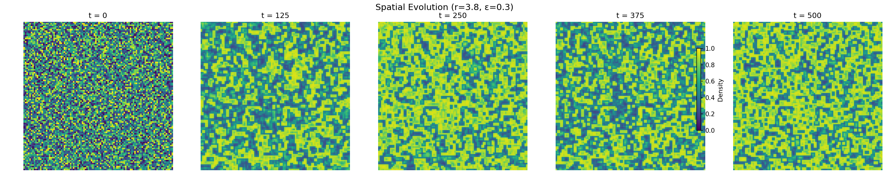
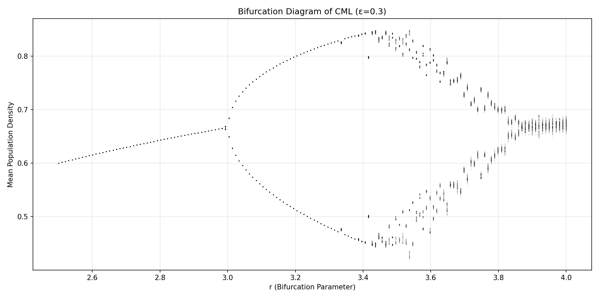
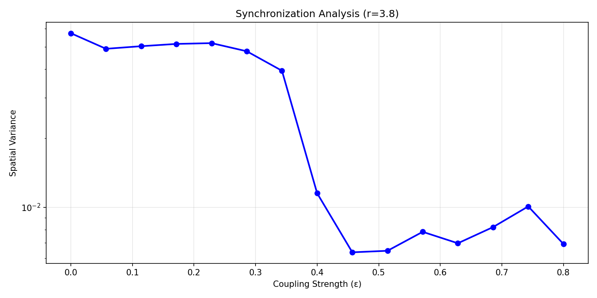
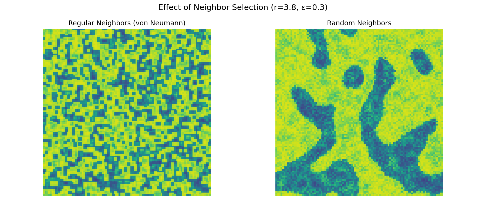

# Raport: Symulacja Chaosu Czasowo-Przestrzennego w Ciągłych Automatach Komórkowych

## 1. Wstęp

Celem niniejszego projektu było zbadanie zjawiska chaosu czasowo-przestrzennego w układach populacyjnych modelowanych za pomocą ciągłych automatów komórkowych. Model ten opisuje dynamikę populacji rozmieszczonej na siatce 2D, gdzie każdy węzeł (nisza) posiada stan reprezentujący gęstość populacji (wartość ciągła z przedziału [0, 1]).

Ewolucja układu jest determinowana przez lokalną dynamikę wewnątrzkomórkową (funkcja logistyczna) oraz dyfuzję (sprzężenie z sąsiadami).

## 2. Model Matematyczny

Podstawą symulacji jest odwzorowanie logistyczne, które dla pojedynczej populacji przyjmuje postać:

$$ f(x) = r \cdot x \cdot (1 - x) $$

gdzie:
- $x$ - gęstość populacji ($x \in [0, 1]$)
- $r$ - parametr wzrostu (parametr kontrolny chaosu)

Dla siatki 2D o wymiarach $N \times N$, stan komórki w pozycji $(i, j)$ w chwili $n+1$ zależy od jej stanu w chwili $n$ oraz stanów jej sąsiadów. 

## 3. Implementacja

Symulacja została zaimplementowana w języku Python z wykorzystaniem biblioteki `NumPy` do obliczeń macierzowych oraz `Matplotlib` do wizualizacji. Siatka ma wymiary $100 \times 100$, a warunki brzegowe są periodyczne (torus).

## 4. Wyniki i Obserwacje

### 4.1. Ewolucja Czasowo-Przestrzenna

Przeprowadzono symulację dla $r=3.8$ (pełny chaos) i $\epsilon=0.3$.
Zaobserwowano, że mimo iż każda komórka dąży do zachowania chaotycznego, sprzężenie z sąsiadami powoduje powstawanie krótkotrwałych struktur przestrzennych o zbliżonych wartościach. Układ nie jest jednorodny, ale wykazuje dynamiczną zmienność w czasie i przestrzeni – jest to istota chaosu czasowo-przestrzennego.

### 4.2. Diagram Bifurkacyjny

Zbadano zachowanie układu w zależności od parametru $r$. Wykres bifurkacyjny pokazuje, jak zmieniają się możliwe stany populacji w stanie ustalonym (lub po wielu iteracjach) w funkcji $r$.
- Dla $r < 3.0$ populacja stabilizuje się w punkcie stałym.
- Dla $3.0 < r < 3.57$ obserwujemy podwajanie okresu (kaskada bifurkacji).
- Dla $r > 3.57$ pojawia się chaos.
- Dla $r>3.8$ populacja się ponownie stabilizuje.

W układzie przestrzennym diagram ten jest "rozmyty" w porównaniu do pojedynczego odwzorowania logistycznego, ponieważ sprzężenie $\epsilon$ uśrednia wartości sąsiadów, co może tłumić lub modyfikować chaotyczne trajektorie.

### 4.3. Synchronizacja

Zbadano wpływ siły sprzężenia $\epsilon$ na synchronizację układu.
- **Małe $\epsilon$ (słabe sprzężenie):** Komórki zachowują się niemal niezależnie, dominuje chaos lokalny. Obraz siatki przypomina szum ("śnieżenie").
- **Duże $\epsilon$ (silne sprzężenie):** Sąsiedzi silnie wpływają na siebie, co prowadzi do synchronizacji fazowej lub powstawania dużych domen o zgodnej fazie. W skrajnym przypadku (bardzo duże $\epsilon$) cały układ może dążyć do jednorodnego stanu, mimo chaotycznej natury lokalnej funkcji $f(x)$.

Miarą synchronizacji może być odchylenie standardowe stanów wszystkich komórek w siatce w danej chwili czasu. Spadek odchylenia standardowego sugeruje wzrost synchronizacji.

### 4.4. Losowi Sąsiedzi

W eksperymencie z losowym doborem sąsiadów (zamiast stałych sąsiadów z siatki) zauważono zmianę dynamiki.
Gdy sąsiedzi są wybierani losowo w każdym kroku (lub połączenia są stałe, ale losowe - tzw. sieci "małego świata" lub losowe), zanika lokalna struktura przestrzenna. Informacja rozchodzi się znacznie szybciej po całym układzie.
Prowadzi to do szybszej synchronizacji globalnej lub (w zależności od parametrów) do uśrednienia fluktuacji, co może "uspokoić" chaos (efekt uśredniania pola średniego).

## 5. Wnioski i Odpowiedzi na Pytania

**Dlaczego obserwujemy takie zachowanie systemu?**
Zachowanie systemu wynika z konkurencji dwóch procesów:
1.  **Lokalna niestabilność (Chaos):** Odwzorowanie logistyczne dla dużych $r$ (np. $r=3.8$) powoduje wykładnicze. To źródło nieporządku.
2.  **Dyfuzja (Sprzężenie):** Człon $\epsilon$ dąży do wyrównania różnic między sąsiadami, wprowadzając korelację przestrzenną.

Równowaga między tymi siłami tworzy skomplikowane wzory czasowo-przestrzenne.

**Czynniki decydujące o chaosie:**
- **Nieliniowość:** Funkcja logistyczna jest nieliniowa ($x^2$), co jest warunkiem koniecznym chaosu.
- **Parametr $r$:** Steruje stromością paraboli logistycznej, a tym samym "siłą" nieliniowości i chaotyczności.
- **Wymiarowość:** Układ ma ogromną liczbę stopni swobody ($N \times N$).

**Synchronizacja:**
Jest to zjawisko, w którym mimo chaotycznej dynamiki poszczególnych elementów, układ jako całość zaczyna zachowywać się w sposób uporządkowany (np. wszystkie komórki oscylują w fazie). Zwiększanie $\epsilon$ zwiększa "sztywność" ośrodka i sprzyja synchronizacji.

**Losowi sąsiedzi:**
Wprowadzenie losowości w połączeniach niszczy lokalność oddziaływań. Układ traci charakter "przestrzenny" (w sensie metryki euklidesowej na siatce) i staje się układem globalnie sprzężonym. Sprzyja to szybszemu wyrównywaniu się stanów (synchronizacji) lub, przy słabym sprzężeniu, sprawia, że fluktuacje stają się nieskorelowanym szumem.
