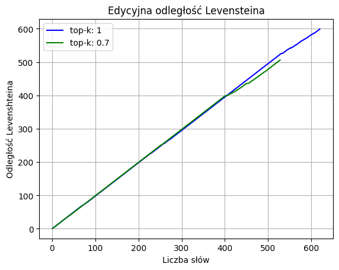
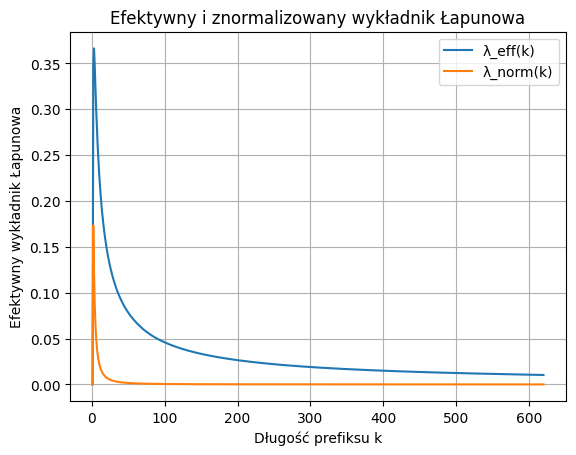
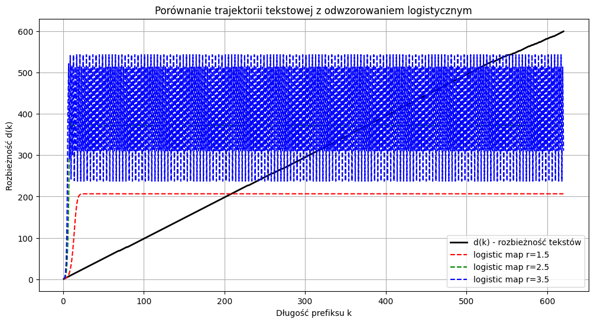

# Sprawozdanie 

## Opis eksperymentu

Do wygenerowanie tesktu skorzystaliśmy z modelu Gemini na platformie Google AI Studio, gdzie mieliśmy możliwość kontrolowanie parametru temperatury.

Parametr temepratury został ustawiony na wartość 0 (niska kreatywność modelu). W celu otrzymania poprawnej długości tekstu skorzystaliśmy z `system instructions` z myślą, że nie będzie miało to wpływu na `seeda`.

Ostatnim krokiem były ustawienie metody doboru kolejnych tokenów podczas procesu generowanie tekstu. Tutaj ustawiliśmy, `Top P` (Probability threshold for top-p sampling) - na wartość 0. Znacząco zredukowało to losowość generowania tesktu.

## Seedy:

**seed_a**: `Wygeneruj krótką i wesołą historię o przygodach kota`

**seed_b**: `Wygeneruj krótką i wesołą historię o przygodach kotka`

Warto zwrocić uwagę, że różnice między zapytaniami są nieznaczne. Róznica polega na zdrobnieniu słowa 'kota' na 'kotka'.

## Odpowiedzi

### Top-k: 1 - model bardziej deterministyczny

**odpowiedź na seed_a**:

Mruczek, kot o futrze w kolorach zachodzącego słońca i oczach jak dwa bursztyny, nie był zwykłym kanapowcem. Był, w swoim mniemaniu, tajnym agentem, mistrzem kamuflażu (zwłaszcza w stosie prania) i nieustraszonym łowcą. Jego obecna misja? Najważniejsza w jego dziewięciu życiach.

Wszystko zaczęło się od puszki. Nie byle jakiej puszki, ale tej, która stała na najwyższej półce w spiżarni – Puszki Ostatecznej Sardynki. Mruczek wiedział, że w środku kryje się ostatni, najdoskonalszy, najbardziej aromatyczny kawałek ryby, jaki kiedykolwiek pływał w oceanie. Jego Człowiek, zwany pieszczotliwie „Wielkim Dostawcą Jedzenia”, miał zwyczaj oszczędzać tę puszkę na „specjalną okazję”. Dla Mruczka, każda chwila, w której nie jadł sardynki, była okazją do jej zjedzenia.

Plan był prosty, choć wymagał precyzji godnej szwajcarskiego zegarka.

Faza I: Dywersja

Mruczek musiał odwrócić uwagę Wielkiego Dostawcy. Wybrał sprawdzoną metodę: atak na stopę.

Czekał cierpliwie, aż Człowiek usiądzie na kanapie, pogrążony w hipnotycznym transie oglądania ruchomych obrazków na szklanym pudle. Wtedy, z gracją pantery, Mruczek rzucił się na wystającą spod koca piętę.

„Ała! Mruczek, co ty robisz?” – krzyknął Człowiek, podskakując.

Sukces. Człowiek był rozproszony.

Faza II: Wspinaczka na Everest Spiżarni

Spiżarnia była fortecą. Drzwi były zamknięte, ale Mruczek znał słaby punkt – uchylone okno na korytarzu, prowadzące do dachu garażu, a stamtąd na dach spiżarni.

Wyskoczył przez okno z zwinnością, której pozazdrościłby mu każdy ninja. Dach był śliski od porannej rosy, ale Mruczek, używając pazurów jak raki, wspiął się na szczyt. Z góry, spiżarnia wyglądała jak mały, drewniany bunkier.

Zauważył mały, zapomniany wywietrznik. Był zakurzony i ledwo trzymał się na zawiasach.

„Idealnie,” pomyślał Mruczek, oblizując wąsy.

Wcisnął się w otwór. Było ciasno, ciemno i pachniało starymi ziemniakami. Po chwili zsunął się w dół, lądując miękko na worku z mąką.

Faza III: Operacja „Sardynka”

Mruczek rozejrzał się. Puszka Ostatecznej Sardynki lśniła na najwyższej półce, niczym Święty Graal.

Półki były ułożone kaskadowo. Najpierw musiał dostać się na półkę z dżemami. Skok był ryzykowny. Wziął głęboki oddech (który pachniał kiszonymi ogórkami) i skoczył.

Wylądował idealnie, ale słoik z konfiturą z malin zachwiał się niebezpiecznie. Mruczek musiał użyć ogona jako przeciwwagi, balansując na krawędzi.

Następnie, półka z makaronami. Mruczek musiał przebiec przez labirynt spaghetti. W pewnym momencie potknął się o paczkę penne, która spadła z hukiem.

BUM!

Mruczek zamarł. Czy Człowiek usłyszał?

Na szczęście, Człowiek był zajęty krzykiem na szklane pudło, które pokazywało, jak ktoś przegrywa w grę sportową.

Mruczek dotarł do ostatniej półki. Puszka była tuż obok.

Wystarczyło ją zepchnąć.

Użył całej swojej kociej siły, pchając łapami. Puszka zaczęła się toczyć.

TUP! TUP! TUP!

Spadła na podłogę z metalicznym brzękiem.

Faza IV: Konfrontacja i Triumf

Mruczek zeskoczył na podłogę. Puszka była cała, ale zamknięta.

W tym momencie drzwi spiżarni otworzyły się z hukiem.

„Co tu się dzieje?!” – Człowiek stał w progu, zdezorientowany. Zobaczył Mruczka siedzącego triumfalnie obok puszki.

Mruczek spojrzał na niego z miną, która mówiła: „Misja zakończona. Teraz otwórz łup.”

Człowiek westchnął, potrząsnął głową i uśmiechnął się.

„Ach, Mruczek. Znowu ty. Czy ty wiesz, ile kosztuje naprawa wywietrznika?”

Wziął puszkę do ręki. Mruczek zaczął ocierać się o jego nogi, mrucząc jak mały silnik odrzutowy.

„No dobrze, dobrze. Zasłużyłeś. To była naprawdę specjalna okazja. Okazja, by w końcu zjeść tę cholerną sardynkę, zanim zdemolujesz mi dom.”

Człowiek otworzył puszkę. Zapach był niebiański. Mruczek poczuł, jak jego serce bije szybciej.

Kiedy Człowiek postawił przed nim miseczkę z Ostateczną Sardynką, Mruczek poczuł, że wszystkie trudy wspinaczki, dywersji i balansowania na dżemach były tego warte.

Zaczął jeść, delektując się każdym kęsem.

Leżąc później na kanapie, z pełnym brzuszkiem i zadowolonym mruczeniem, Mruczek wiedział, że jest bohaterem. Ocalił sardynkę przed strasznym losem bycia „oszczędzaną”.

A jutro? Jutro zacznie planować, jak dostać się do tej nowej, intrygującej puszki z tuńczykiem, którą Człowiek właśnie schował na najwyższej półce. W końcu, praca tajnego agenta nigdy się nie kończy.

**odpowiedź na seed_b**:

Puszek był małym, puchatym kotkiem o futerku w kolorze świeżo ubitej śmietany i oczach tak niebieskich, że przypominały dwa kawałki letniego nieba. Mieszkał w przytulnym domku z ogrodem pełnym tajemnic, a jego życie było nieustanną, radosną przygodą. Puszek nie był typem, który spędzałby całe dnie na drzemce. Był odkrywcą, łowcą i, co najważniejsze, mistrzem w robieniu słodkich min, gdy chciał dostać dodatkową porcję tuńczyka.

Pewnego słonecznego poranka, Puszek obudził się z niezwykłym poczuciem misji. Leżał na parapecie, wygrzewając się w promieniach słońca, gdy nagle zobaczył TO.

To było coś, co migotało, tańczyło i unosiło się w powietrzu z gracją, której pozazdrościłby mu każdy baletmistrz. Był to motyl. Ale nie byle jaki motyl. Ten był w kolorze płynnego złota, z delikatnymi, czarnymi wzorami na skrzydłach. Puszek natychmiast nadał mu imię: „Kapitan Błysk”.

„Muszę go złapać!” – pomyślał Puszek, a jego małe serce zabiło szybciej z ekscytacji. Nie chodziło o to, żeby zrobić Kapitanowi Błyskowi krzywdę. Chodziło o to, by udowodnić sobie i światu, że jest najszybszym i najsprytniejszym łowcą w całym ogrodzie.

Misja rozpoczęła się od strategicznego zejścia z parapetu. Puszek, z ogonem uniesionym jak maszt, przeszedł w tryb „cichego drapieżnika”. Jego kroki były tak lekkie, że nawet najdelikatniejszy płatek róży nie drgnął.

Kapitan Błysk, nieświadomy zbliżającego się niebezpieczeństwa, wylądował na dużej, czerwonej piwonii. Puszek skulił się, przygotowując do skoku. W jego głowie rozbrzmiewała epicka muzyka, a on sam czuł się jak bohater filmu akcji.

Skok!

Niestety, Puszek nie wziął pod uwagę jednej rzeczy: trawa była mokra od porannej rosy. Zamiast eleganckiego lądowania na piwonii, Puszek wylądował z głośnym „Plumf!” w miękkiej ziemi, tuż obok grządki marchewek. Jego białe futerko natychmiast pokryło się brązowymi plamami.

Kapitan Błysk, spłoszony hałasem, wzbił się w powietrze i odleciał w stronę starej jabłoni.

Puszek otrząsnął się, a jego mina wyrażała mieszankę frustracji i determinacji. „To była tylko rozgrzewka!” – mruknął do siebie, oblizując nos.

Pościg przeniósł się do labiryntu krzewów porzeczek. Puszek musiał wykazać się niezwykłą zwinnością, lawirując między gałązkami. W pewnym momencie, Kapitan Błysk wpadł w pułapkę – utknął na chwilę w pajęczynie rozciągniętej między dwoma liśćmi.

To była szansa Puszka!

Kot podbiegł, ale zamiast rzucić się na motyla, zatrzymał się. Zobaczył, jak Kapitan Błysk desperacko próbuje się uwolnić. Puszek, mimo swojej łowieckiej natury, miał złote serce. Nie mógł patrzeć na cierpienie, nawet jeśli chodziło o jego cel.

Delikatnie, używając tylko czubka swojego pyszczka, Puszek rozerwał pajęczynę. Kapitan Błysk, wolny, zatoczył kółko wokół głowy Puszka, jakby dziękując mu za ratunek.

Puszek usiadł na trawie, patrząc, jak złoty motyl odlatuje w stronę słońca. Czuł się dziwnie zadowolony. Nie złapał go, ale zyskał coś cenniejszego – poczucie, że postąpił słusznie.

Wrócił do domu, brudny, ale szczęśliwy. Jego Pani, widząc go w takim stanie, tylko się roześmiała.

„Co ty znowu wymyśliłeś, mój mały brudasie?” – zapytała, podnosząc go na ręce.

Puszek, mrucząc głośno, wtulił się w jej ramię. Wiedział, że jutro czeka go nowa przygoda. Może tym razem będzie to walka z groźnym cieniem na ścianie, albo eksploracja tajemniczego kartonowego pudła. Jedno było pewne: życie Puszka nigdy nie było nudne, a każda porażka była tylko wstępem do kolejnego, jeszcze bardziej wesołego rozdziału. A Kapitan Błysk? Od czasu do czasu przelatywał nad ogrodem, przypominając Puszka o ich niezwykłej przyjaźni.

Już przy tak niewielkiej zmianie promptu, odpowiedzi są kompletnie różne nawet przy ustawieniu. 

### Top-k: 0.7 - modelj mniej deterministyczny

**odpowiedź na seed_a**:

Mruczek, znany w swoim małym, przytulnym mieszkaniu jako „Kapitan Futrzany” (choć nikt poza nim o tym nie wiedział), był kotem o niezwykłej ambicji. Jego misją życiową było pilnowanie porządku… i polowanie na cokolwiek, co się ruszało, a co najważniejsze – na jego ulubioną, pluszową myszkę, Myszkę Mruczusia.

Pewnego słonecznego wtorku, Kapitan Futrzany obudził się z poczuciem, że coś jest nie tak. Zwykle Myszka Mruczuś czekała na niego pod łóżkiem, gotowa na poranną sesję „rzucania i aportowania” (gdzie Mruczek rzucał, a potem sam aportował, bo nikt inny nie był godny). Dziś – pustka.

„Alarm! Alarm!” – zamiauczał Mruczek, zeskakując z łóżka z gracją, która mogłaby zawstydzić baletnicę (gdyby baletnica ważyła 5 kilogramów i miała ogon).

Rozpoczęła się Kocia Misja.

Pierwszym podejrzanym był Odkurzacz, ten hałaśliwy potwór, który zawsze próbował wciągnąć Mruczusia. Mruczek obszedł go ostrożnie, prychając na jego kabel. Odkurzacz milczał, co było podejrzane, ale Myszki tam nie było.

Drugim podejrzanym była Roślina Doniczkowa, znana jako „Zielony Zdrajca”, ponieważ zawsze zrzucała liście na podłogę, utrudniając pościg. Mruczek sprawdził ziemię – tylko brud i ślady jego własnych łap.

W końcu, Mruczek dotarł do centrum dowodzenia – Kuchni. To tam, na blacie, stał Wielki Karton. Karton był nowym nabytkiem w mieszkaniu i Mruczek podejrzewał go o ukrywanie tajemnic.

Wskoczył na blat. Karton był duży, brązowy i pachniał… nowością. Mruczek ostrożnie zajrzał do środka.

W środku Kartonu nie było Myszki Mruczusia. Było coś lepszego.

Było tam mnóstwo papieru pakowego, idealnego do drapania, i kilka małych, okrągłych piłeczek, które wyglądały jak miniaturowe planety. Ale co najważniejsze, Karton był idealnym schronieniem.

Mruczek zapomniał o Myszce Mruczusiu. Karton stał się jego nowym zamkiem.

Wtem, usłyszał cichy szelest. Spojrzał w dół.

Pod Kartonem, ledwo widoczna, leżała Myszka Mruczuś. Wyglądała na zadowoloną. Okazało się, że Myszka Mruczuś wcale nie zaginęła. Po prostu postanowiła się ukryć w najbardziej oczywistym miejscu, czekając, aż Kapitan Futrzany odkryje nowy, ekscytujący Karton.

Mruczek zeskoczył z blatu, chwycił Myszka Mruczusia w zęby i zaniósł ją z powrotem do Kartonu.

„Misja zakończona sukcesem!” – zamruczał, układając się wygodnie na papierze pakowym.

Resztę dnia Kapitan Futrzany spędził na pilnowaniu swojego nowego zamku, od czasu do czasu atakując Myszka Mruczusia, tylko po to, by upewnić się, że jest bezpieczna.

W końcu, bycie Kapitanem Futrzanym było męczące. Ale z Kartonem i Myszką Mruczusiem u boku, świat był idealny. A jutro? Jutro czekała go nowa misja: zbadanie, dlaczego woda w misce jest zawsze mokra. Ale to już inna historia.

**odpowiedź na seed_b**:

Puszek był małym, puszystym kotkiem o oczach wielkich jak guziki i ogonie, który zawsze radośnie podskakiwał. Mieszkał w przytulnym domku z ogrodem, ale jego serce, a właściwie małe, kocie serduszko, pragnęło przygód.

Pewnego słonecznego poranka, gdy Puszek leniwie wyciągał się na parapecie, zobaczył TO.

To był Motyl. Nie byle jaki motyl. Był to motyl w kolorze tęczy, z migoczącymi skrzydłami, które tańczyły w powietrzu jak małe, kolorowe fajerwerki.

„Ojej!” – miauknął Puszek, a jego uszy natychmiast stanęły na baczność. „To jest najpiękniejsza rzecz, jaką kiedykolwiek widziałem! Muszę go złapać!”

I tak rozpoczęła się Wielka Wyprawa Puszka po Motyla.

Motyl, jakby wiedział, że jest obiektem pożądania, z gracją odleciał w głąb ogrodu. Puszek skoczył z parapetu z taką energią, że omal nie przewrócił doniczki z geranium.

Pierwszą przeszkodą była „Dżungla Trawy”. Trawa była wyższa niż Puszek, a każdy źdźbło wydawało się groźnym, zielonym mieczem. Puszek czołgał się, skakał i nurkował, a jego białe futerko szybko pokryło się rosą i pyłkami.

„Motyl! Czekaj!” – wołał w myślach, choć wiedział, że motyle nie słuchają kotów.

W końcu wydostał się z Dżungli Trawy i stanął przed „Górą Piasku”. Była to w rzeczywistości mała piaskownica, ale dla Puszka wydawała się Mount Everestem. Wdrapał się na nią z determinacją godną himalaisty, ślizgając się i zrzucając małe lawiny piasku.

Na szczycie Góry Piasku, Motyl zatrzymał się na chwilę, siadając na czerwonej łopatce. Puszek zebrał się do decydującego skoku.

Skok!

Puszek wylądował idealnie… obok łopatki. Motyl, jakby złośliwie, wzbił się w powietrze i poleciał w stronę „Strasznego Lasu”.

Straszny Las był w rzeczywistości krzakiem róż. Był straszny, bo miał kolce.

Puszek, choć trochę przestraszony, nie poddał się. Wcisnął się ostrożnie między gałęzie, starając się nie zahaczyć futerkiem o ostre kolce. Szedł powoli, a jego serce biło jak dzwon.

W środku krzaka róż, Motyl usiadł na pięknej, różowej róży. Puszek był już bardzo blisko. Wyciągnął łapkę, delikatnie, by nie spłoszyć kolorowego stworzenia.

W tym momencie, z góry, rozległ się głośny, wesoły dźwięk: „Hau! Hau!”

Był to Burek, duży, przyjazny pies sąsiadów, który właśnie przeskoczył przez płot. Burek, widząc Puszka w krzaku, pomyślał, że to świetna zabawa.

Puszek, przerażony nagłym hałasem, zapomniał o Motylu. Wystrzelił z krzaka jak rakieta, a Burek, myśląc, że to zabawa w berka, ruszył za nim.

Puszek biegł najszybciej, jak potrafił, z powrotem przez Górę Piasku i Dżunglę Trawy. Wpadł do domu przez uchylone drzwi i schował się pod kanapą, dysząc ciężko.

Burek, zdezorientowany, zatrzymał się przy drzwiach i tylko radośnie zamerdał ogonem.

Po kilku minutach, gdy Puszek upewnił się, że jest bezpieczny, wyszedł spod kanapy. Był brudny, zmęczony, ale cały.

Spojrzał na parapet. Motyl, ten sam tęczowy motyl, wleciał przez otwarte okno i usiadł na jego nosie.

Puszek zamarł. Czuł delikatne łaskotanie skrzydeł. Motyl patrzył na niego swoimi małymi, czarnymi oczkami.

Puszek nie próbował go złapać. Zrozumiał, że niektóre rzeczy są piękniejsze, gdy się na nie patrzy, niż gdy się je posiada.

Motyl po chwili odleciał, tańcząc w promieniach słońca.

Puszek westchnął, zadowolony. To była długa i wyczerpująca przygoda. Teraz zasłużył na drzemkę.

Zwinął się w kłębek na miękkim dywanie, a w jego snach tańczyły tęczowe motyle i zielone miecze z trawy. Był gotowy na kolejną przygodę – ale dopiero po solidnej drzemce.

## Odległość Levenstein'a

W tym przypadku wykorzystanie odległości Levenshteina nie jest optymalnym rozwiązaniem. Na wykresie widać linię `y = x`, co sugeruje brak korelacji między porównywanymi odpowiedziami — efekt naturalny przy zupełnie różnych danych wejściowych.

Lepszą alternatywą mogłaby być metryka cosine_similarity, która ocenia podobieństwo wektorów w przestrzeni semantycznej, a nie jedynie różnice w kolejności znaków. Dzięki temu można uzyskać bardziej miarodajne wyniki, zwłaszcza gdy interesuje nas znaczenie tekstu, a nie jego dosłowna forma.

Dodatkowo warto rozważyć normalizację wektorów lub zastosowanie embeddingów z modelu językowego, co pozwoli uchwycić subtelne podobieństwa semantyczne między odpowiedziami.

## Wykładnik Lapunowa

Na wykresie przedstawiono efektywny i znormalizowany wykładnik Łapunowa w zależności od długości sekwencji.
Widać, że oba wykładniki maleją w kierunku zera. Taki trend sugeruje stopniowe zmniejszanie się chaosu w systemie, co jest zgodne z oczekiwaniami - ponieważ rozbieżność między odpowiedziami utrzymuje się na stałym poziomie, efektywna dynamika systemu stabilizuje się wraz ze wzrostem długości prefiksu.

## Porównanie mapy logistycznej z modelem językowym

### Analogia

| **Odwzorowanie logistyczne**                          | **Generacja tekstu (LLM)**                                           | **Uwagi / Metafora chaosu**                                                                     |
| ----------------------------------------------------- | -------------------------------------------------------------------- | ----------------------------------------------------------------------------------------------- |
| (x_n) – obecny stan                                   | (x_n) – bieżąca reprezentacja semantyczna kontekstu                  | Reprezentacja „trajektorii” w przestrzeni semantycznej                                          |
| (x\_{n+1} = r x_n (1 - x_n)) – reguła iteracyjna      | Generacja kolejnego tokenu na podstawie kontekstu i parametrów       | Funkcja deterministyczna + losowość parametrów (temperature, top-p)                             |
| (r) – parametr sterujący dynamiką                     | top-p / siła promptu                                                 | Większe (r) → większa wrażliwość na seed; wyższa temperatura → większa „chaotyczność” generacji |
| Iteracja (x*n \to x*{n+1})                            | Iteracja (x*n \to x*{n+1}) przy generowaniu tokenu                   | Każdy nowy token to krok w trajektorii tekstowej                                                |
| Odległość między trajektoriami przy małej perturbacji | Levenshtein distance d(k) między tekstami z minimalnie różnym seedem | Wzrost rozbieżności → analogia do dodatniego wykładnika Lapunowa                                |
| Stabilny punkt / atraktor                             | Stały motyw / powtarzalny styl w generowanym tekście                 | Mała wrażliwość na seed, trajektoria pozostaje blisko siebie                                    |
| Chaotyczny reżim                                      | Szybkie „rozbieganie się” tekstów przy minimalnej zmianie seeda      | λ_eff > 0, ekspansja semantyczna, trudna przewidywalność                                        |

Można zauważyć różnice jak ten chaos powienien wyglądać. Dla modelu jężykowego, ta rozbieżność liniowo rośnie. 

## Wnioski

- Już niewielkie zmiany w treści zapytania (np. zdrobnienie słowa „kota” na „kotka”) prowadzą do znacznie różniących się odpowiedzi, nawet przy identycznych ustawieniach parametrów generowania. Świadczy to o wysokiej wrażliwości modeli językowych na drobne perturbacje w seedzie, co należy uwzględniać przy eksperymentach wymagających powtarzalności wyników.

- Warto rozważyć użycie mniejszego modelu do tego eksperymentu, ponieważ jest on prostszy i bardziej przewidywalny.

- Odległość Levenshteina nie jest odpowiednią metryką dla tego typu zadań. W przypadku wygenerowanych słów lub tokenów lepiej jest najpierw uzyskać ich reprezentacje wektorowe za pomocą modelu do embeddowania, a następnie obliczyć cosine_similarity. Metryka Levenshteina ocenia jedynie podobieństwo w zapisie słów, więc wyrazy o zbliżonym znaczeniu mogą zostać uznane za odległe, jeśli różnią się brzmieniem.
