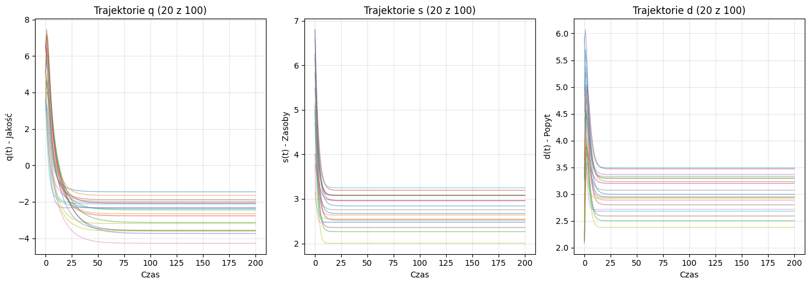
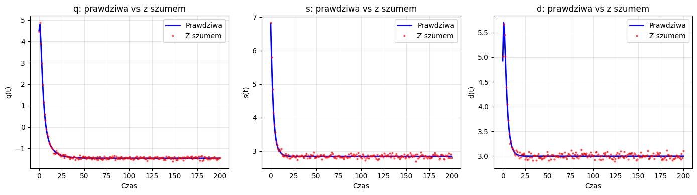
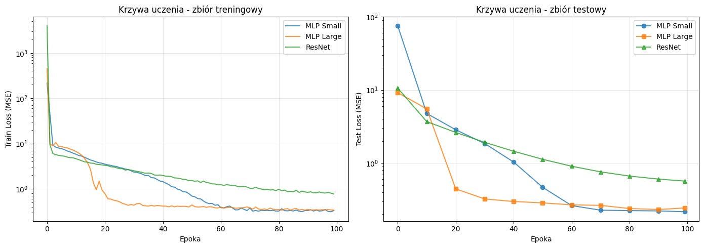
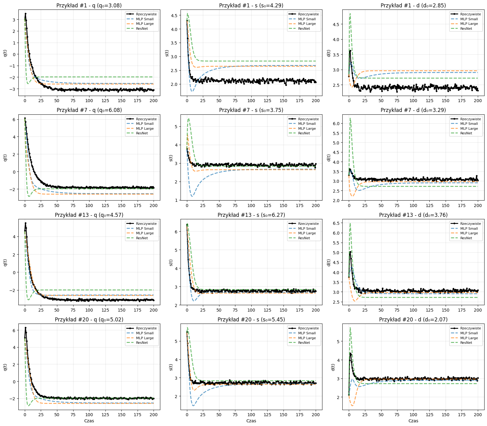
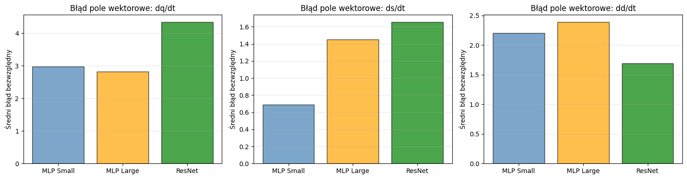

# Sprawozdanie: Neuronowe Równania Różniczkowe (Neural ODE)

_Autorzy: Jerzy Boksa, Bartosz Gacek_

## 1. Cel ćwiczenia

Celem laboratorium było zapoznanie się z problematyką i zastosowaniem Neuronowych Równań Różniczkowych (Neural ODE - NODE) do modelowania układów dynamicznych oraz predykcji szeregów czasowych.

## 2. Przygotowanie danych (Trajektorie referencyjne)

Zgodnie z poleceniem, wygenerowano dane referencyjne ("prawdziwe") w oparciu o **Model Logistyczny** (projekt) opisujący dynamikę trzech zmiennych w czasie:

- **q(t)**: Jakość
- **s(t)**: Zasoby (Supply)
- **d(t)**: Popyt (Demand)

Układ równań różniczkowych opisujący model:

$$
\begin{cases}
\displaystyle \frac{dq}{dt} = s(t) - d(t) - \alpha q & \text{(zmiana magazynu/produktu)} \\[1em]
\displaystyle \frac{ds}{dt} = \beta \left(1 - \frac{s}{S_{\rm max}}\right) - \gamma s d & \text{(produkcja rośnie, ale hamowana przez popyt i saturację)} \\[0.5em]
\displaystyle \frac{dd}{dt} = \delta \left(1 - \frac{d}{D_{\rm max}}\right) + \eta (s - d) & \text{(popyt rośnie, jeśli supply > demand, maleje jeśli supply < demand)}
\end{cases}
$$

### Parametry symulacji:

- **Siatka czasowa:** Symulację przeprowadzono dla czasu $t$ od 0 do 200.
- **Zbiór danych:** Wygenerowano **100 trajektorii** różniących się warunkami początkowymi oraz niewielkimi zmianami parametrów modelu.
- **Szum pomiarowy:** Do danych dodano szum gaussowski na poziomie 5%, aby zasymulować realne niedokładności pomiarowe.
- **Podział danych:** Zbiór podzielono na część treningową (80%) i testową (20%).

## 3. Model Neural ODE

W podejściu Neural ODE (NODE) dynamika układu jest modelowana przez sieć neuronową. Zamiast szukać jawnego wzoru matematycznego, przyjmujemy, że pochodna stanu po czasie jest funkcją aproksymowaną przez sieć:

$$ \frac{dx}{dt} = f\_\theta(x, t) $$

gdzie $f_\theta$ to sieć neuronowa z wagami $\theta$. Stan układu w dowolnym momencie $t$ obliczany jest poprzez numeryczne całkowanie tej funkcji (użyto solera `rk4` z biblioteki `torchdiffeq`).

## 4. Architektury sieci (Funkcja Dynamiki NODE)

**Ważne rozróżnienie:** W przeciwieństwie do klasycznego uczenia nadzorowanego, gdzie sieć MLP mapuje bezpośrednio wejście na wyjście ($x \to y$), w modelu **Neural ODE** sieć neuronowa uczy się **dynamiki układu** (pola wektorowego). Sieć ta aproksymuje funkcję pochodnej $\frac{dx}{dt} = f_\theta(x)$, a końcowy wynik uzyskiwany jest dopiero po scałkowaniu tej funkcji przez solver ODE.

Zaprojektowano i przetestowano trzy różne architektury funkcji $f_\theta$:

1.  **NODE z funkcją przejścia MLP Small:**
    - Prosta sieć z 2 warstwami ukrytymi (16 neuronów) definiująca pochodną.
    - Cel: Sprawdzenie bazowej zdolności uczenia się dynamiki.
2.  **NODE z funkcją przejścia MLP Large:**
    - Głębsza i szersza sieć (4 warstwy, 64 neurony) jako funkcja dynamiki.
    - Cel: Zwiększenie pojemności modelu dla dokładniejszego dopasowania pola wektorowego.
3.  **NODE z funkcją przejścia ResNet:**
    - Architektura wykorzystująca połączenia skrótowe (residual connections) do modelowania pochodnej.
    - Cel: Ułatwienie trenowania głębszych struktur i stabilizacja gradientów w procesie całkowania.

## 5. Przebieg uczenia i wyniki

Modele trenowano przez 100 epok, minimalizując błąd średniokwadratowy (MSE) między przewidywaną a rzeczywistą trajektorią.

### Krzywe uczenia

Poniższy wykres przedstawia spadek funkcji straty (Loss) w trakcie uczenia dla wszystkich trzech architektur.

**Obserwacja:** Na wykresach krzywych uczenia widać, że architektura **ResNet** osiąga gorsze wyniki w porównaniu do modeli MLP. Model **MLP Large** charakteryzuje się najszybszą zbieżnością zarówno na zbiorze treningowym, jak i testowym. Warto jednak zauważyć, że około 60. epoki wyniki modelu MLP Large zbiegają się z wynikami modelu MLP Small, co sugeruje, że mniejsza sieć potrzebuje po prostu więcej czasu na osiągnięcie podobnej dokładności.

### Porównanie predykcji

Modele zostały zweryfikowane na zbiorze testowym. Poniższe wykresy pokazują, jak poszczególne sieci radzą sobie z odtwarzaniem trajektorii q, s, d w porównaniu do danych rzeczywistych.

## 6. Analiza i wnioski (Ekstrapolacja)

Dodatkowo sprawdzono zdolność modeli do **ekstrapolacji**, czyli przewidywania zachowania układu poza zakres czasowy, na którym były uczone (dla $t > 200$).

### Wnioski końcowe:

1.  Technika Neural ODE pozwoliła skutecznie odtworzyć dynamikę nieliniowego modelu logistycznego.
2.  **Porównanie architektur:** Wbrew oczekiwaniom, architektura ResNet osiągnęła gorsze wyniki niż standardowe sieci MLP. Model **MLP Large** wykazał się najszybszym tempem uczenia, jednak ostatecznie (ok. 60 epoki) jego wyniki zrównały się z modelem **MLP Small**. Oznacza to, że w tym przypadku większa pojemność sieci przyspiesza proces uczenia, ale niekoniecznie prowadzi do znacznie lepszego ostatecznego odwzorowania dynamiki.
3.  Modele wykazały zdolność do generalizacji na zbiorze testowym oraz (w ograniczonym stopniu) do ekstrapolacji trendów w przyszłość.

---
