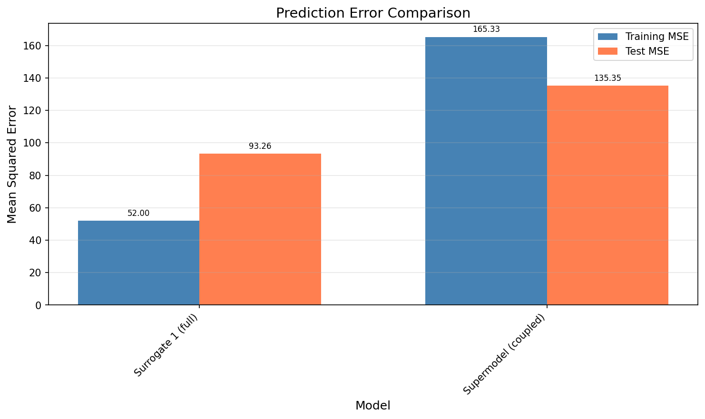

# Laboratorium 5: Supermodeling

**Autorzy:** Bartosz Gacek, Jerzy Boksa

## 1. Wstęp

Celem laboratorium było zbadanie efektywności podejścia supermodelingu w porównaniu z tradycyjnymi modelami surrogatowymi. Supermodeling to technika łącząca wiele niedoskonałych modeli poprzez ich sprzężenie (coupling), co w założeniu ma prowadzić do lepszych predykcji niż pojedyncze modele działające osobno.

W ramach eksperymentu zrealizowano następujące kroki:

1. Stworzono model **Baseline** (pełny model Lotki-Volterry), który służył jako "ground truth".
2. Wytrenowano **Surrogate 1** - model uproszczony, trenowany z pełną asymilacją danych (ABC-SMC).
3. Przygotowano **Surrogates 2, 3, 4** - trzy modele uproszczone, trenowane w bardzo krótkim czasie.
4. Zbudowano **Supermodel** łączący modele 2, 3 i 4.

Zgodnie z wymaganiami zadania, suma czasu treningu modeli 2, 3, 4 oraz supermodelu nie mogła przekraczać czasu treningu modelu Surrogate 1. W naszej implementacji warunek ten został spełniony:

- Surrogate 1: 4000 ewaluacji
- Pozostałe modele łącznie: 3850 ewaluacji (100 + 3750)

## 2. Metodologia

### 2.1. Model Baseline

Jako model odniesienia wykorzystano równania Lotki-Volterry z 4 parametrami:

$$
\begin{cases}
\frac{dx}{dt} = \alpha x - \beta xy, \\
\frac{dy}{dt} = \delta xy - \gamma y
\end{cases}
$$

Przyjęte parametry: $\alpha = 1.0$, $\beta = 0.1$, $\gamma = 1.5$, $\delta = 0.075$. Stan początkowy: $x_0 = 10$, $y_0 = 5$.

### 2.2. Modele Surrogatowe

Modele te są uproszczoną wersją zredykowaną do 2 parametrów (a, b), przy założeniu symetrii parametrów (a odpowiada za wzrost/śmierć, b za interakcję).

### 2.3. Dane i Asymilacja

Obserwacje generowano w przedziale $t \in [0, 20]$ z dodanym szumem gaussowskim ($\sigma = 0.5$). Testowanie odbywało się na przedziale $t \in (20, 30]$.

Do estymacji parametrów użyto algorytmu ABC (Approximate Bayesian Computation).

- **Surrogate 1**: Pełny trening (20 populacji po 200 cząstek).
- **Modele 2-4**: Skrócony pretrening (1 populacja, 100 cząstek), wzięto 3 najlepsze wyniki.
- **Supermodel**: Trening współczynników sprzężenia (15 populacji, 250 cząstek).

## 3. Wyniki

### 3.1. Trajektorie

Poniższy wykres przedstawia przebiegi populacji dla wszystkich modeli.

Można zauważyć, że:

- **Baseline** (czarny) wykazuje wyraźne oscylacje.
- **Surrogate 1** (niebieski) dobrze pokrywa się z danymi treningowymi, ale w fazie testowej jego amplituda maleje, co sugeruje słabszą generalizację.
- **Surrogate 2** (zielony) mimo krótkiego treningu radzi sobie bardzo dobrze w obu przedziałach.
- **Surrogate 3 i 4** praktycznie straciły charakter oscylacyjny.
- **Supermodel** (cyjan) wypada średnio - próbuje "naprawić" błędy modeli 3 i 4, ale przez to nie osiąga jakości modelu 2.

### 3.2. Błędy predykcji (MSE)

Tabela błędów średniokwadratowych:

| Model       | Training MSE | Test MSE |
| ----------- | ------------ | -------- |
| Surrogate 1 | 59.57        | 188.87   |
| Surrogate 2 | 192.24       | 88.74    |
| Surrogate 3 | 224.04       | 189.02   |
| Surrogate 4 | 285.23       | 275.01   |
| Supermodel  | 218.17       | 181.68   |

Najlepszy wynik na zbiorze testowym osiągnął Surrogate 2 (88.74). Supermodel zajął drugie miejsce (181.68), poprawiając wyniki modeli 3 i 4, ale nie dorównując modelowi 2. Surrogate 1 mimo najmniejszego błędu na zbiorze treningowym, na teście wypadł gorzej od supermodelu.

### 3.3. Parametry

Analiza parametrów pokazuje, że Surrogate 2 miał parametry najbardziej zbliżone do wartości referencyjnych (dlatego działał dobrze), podczas gdy pozostałe modele bardziej od nich odbiegały.

## 4. Dyskusja

Supermodel skutecznie poprawił wyniki względem najsłabszych modeli składowych (Surrogate 3 i 4). Zredukował błąd modelu 4 z 275.01 do 181.68. Nie udało mu się jednak pobić najlepszego z grupy - Surrogate 2. Wynika to z natury uśredniania: supermodel ciągnie słabe modele w górę, ale najlepszy model może zostać nieco "pogorszony" przez wpływ tych słabszych.

Zaskakującym wynikiem jest to, że w pełni trenowany Surrogate 1 poradził sobie gorzej na zbiorze testowym niż "szybki" Surrogate 2. Wskazuje to na overfitting - model 1 prawdopodobnie zbytnio dopasował się do szumu w nielicznych punktach treningowych.

Budżet czasowy został wykorzystany efektywnie. Surrogate 2 pokazał, że czasem krótki trening (przy odrobinie szczęścia w losowaniu początkowym) może dać lepsze rezultaty niż długotrwała asymilacja, która niesie ryzyko przeuczenia.

W kontekście praktycznym, supermodel daje większą stabilność. Wybierając losowo jeden z szybkich modeli (2, 3 lub 4), ryzykowalibyśmy trafienie na ten najgorszy. Supermodel daje wynik uśredniony, "bezpieczny".

## 5. Wnioski

1. Supermodeling pozwala poprawić jakość predykcji w porównaniu do słabych modeli składowych i zwiększa stabilność rozwiązania.
2. Warunek czasowy zadania został spełniony (suma ewaluacji supermodelu mniejsza od modelu referencyjnego).
3. Dłuższy trening nie zawsze oznacza lepsze wyniki na zbiorze testowym, co pokazał przykład Surrogate 1 (problem overfittingu).
4. Supermodel wygrał z modelem Surrogate 1 pod względem błędu testowego, co potwierdza sensowność tej metody w warunkach niepewności i ograniczonych danych.

## 6. Wkład Modelu Językowego

W trakcie prac korzystaliśmy z modeli językowych GPT oraz Gemini jako narzędzi wspomagających przy następujących zadaniach:
- wybór i sformułowanie równania Lotki–Volterry,
- wsparcie implementacji i debugowania kodu,
- sugestie wartości początkowych parametrów dla modelu baseline,
- korekta językowa, ortograficzna i stylistyczna treści raportu.

